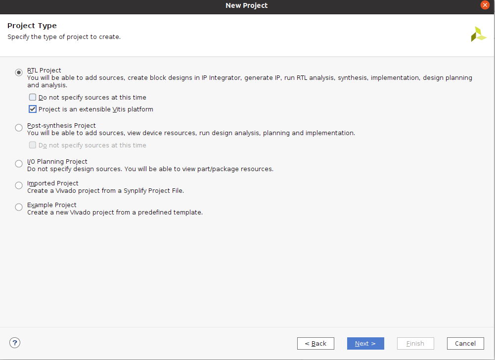
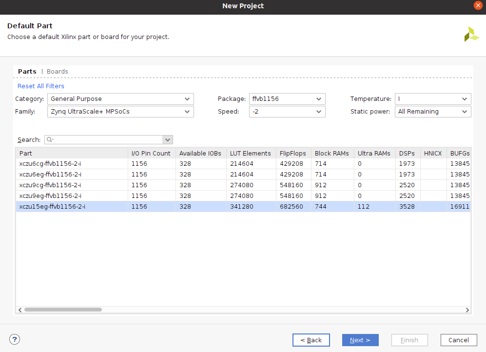
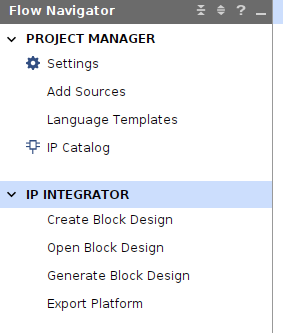
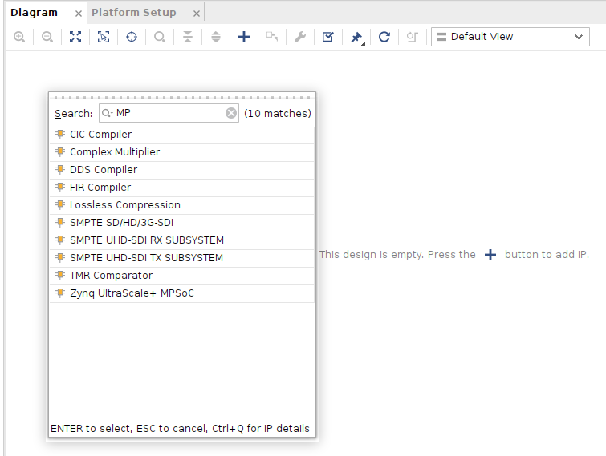
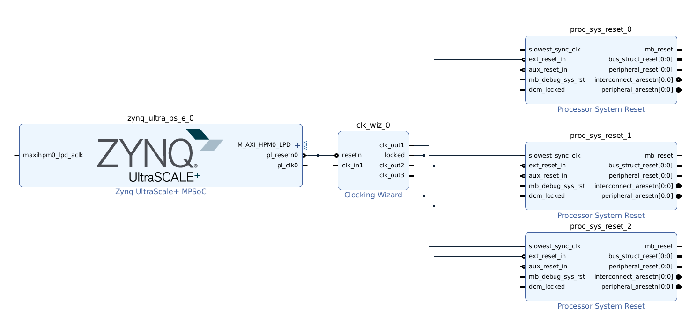
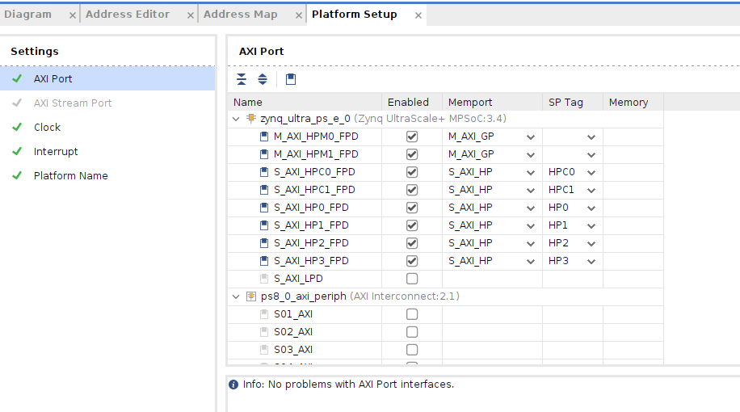
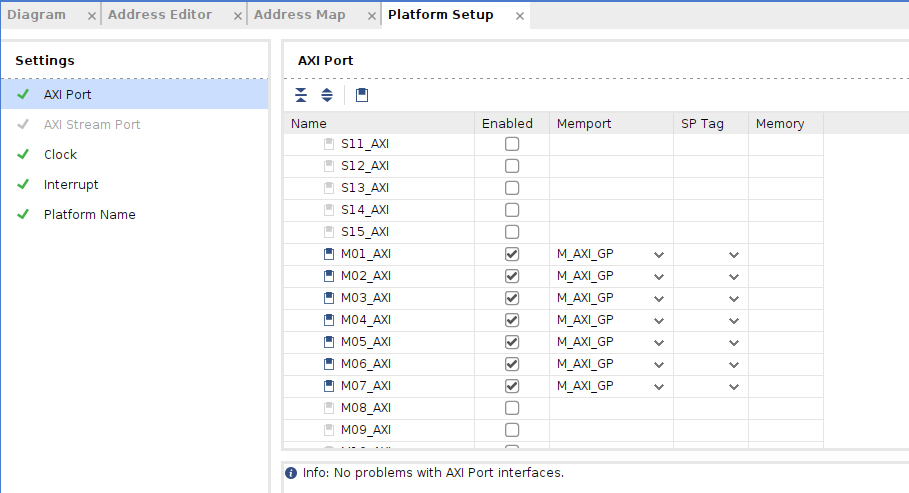
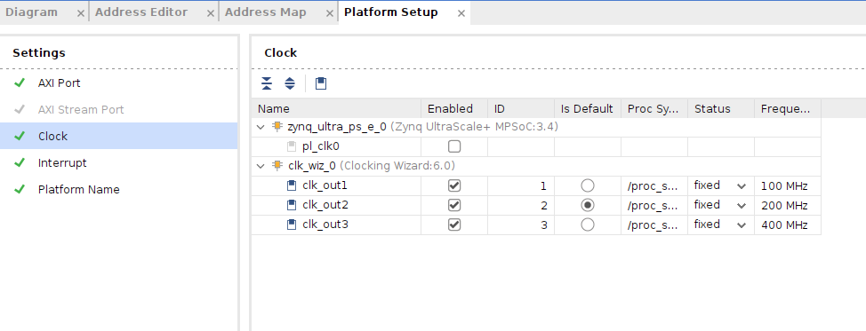
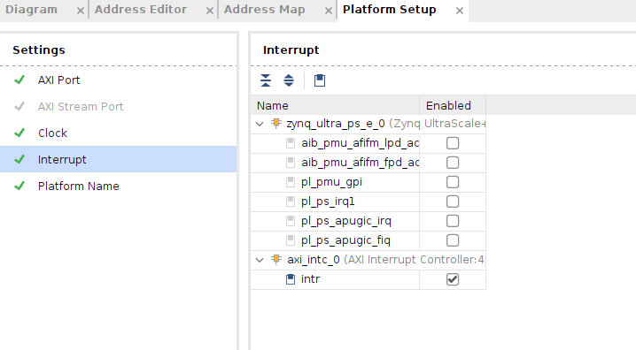
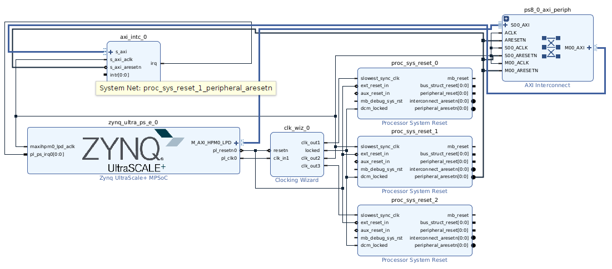

# 创建Vitis应用加速平台的硬件平台（xsa文件）
参考文献

UG1393

Vitis-tutorials github

首先创建vivado工程，创建过程中需要注意的是下面这里需要勾选Project is an extensible platform，其他都按默认选择即可。

最后需要选择对应的FPGA芯片，由于实验室用的是黑金公司的AXU15EG MPSOC开发板，因此选择的器件如下图

创建好vivado工程后，需要在blockdesign中设计对应的平台文件，因此需要创建一个blockdesign模块，如下图

创建完blockdesign后，需要向模块中添加对应的IP核，在blockdesign中，xilinx将ARM硬核看作一个IP核进行配置，首先添加ARM硬核作为异构计算的host。如下图

接下来需要对ARM硬核进行配置，配置ARM硬核需要和开发板对应的外设匹配，在这里按照黑金公司给出的官方教程进行配置，具体的配置流程参考[course_s2ALINX MPSOC开发平台Vitis应用教程](./file/course_s2_ALINX_ZYNQ_MPSoC开发平台Vitis应用教程V1.03.pdf)。

配置好ARM硬核之后，需要添加一些用于算法加速必要的IP核，主要有时钟、复位、中断等。在这里我参考的是[Vitis github](https://github.com/Xilinx/Vitis-Tutorials/tree/2022.2/Vitis_Platform_Creation)中给出的官方教程，也可以参考黑金公司给出的教程，参考[course_s3 ALINX MPSOC开发平台Linux基础教程](./file/course_s3_ALINX_ZYNQ_MPSoC开发平台Linux基础教程V1.01.pdf)。

根据Vitis github中的教程，需要添加时钟IP、复位IP以及中断IP，首先添加时钟IP Clocking Wizard IP、然后打开IP，在output菜单栏下添加三个时钟100MHZ、200MHZ以及400MHZ，同时在Reset Type中选择Active Low，点击OK保存。由于一个时钟需要对应一个复位，因此还需要添加三个复位IP。在此添加三个Processor System Reset 复位IP，然后对添加的IP进行连接，如下图所示：

添加完时钟IP和复位IP，还需要添加中断IP，添加AXI Interrupt Controller 中断IP核，双击配置中断IP核，将Interrupt Output Connection选项改为single。然后需要打开ARM中的PL-PS中断接口，双击ARM IP，进入

    PS-PL Configuration > General > Interrupts > PL-PS 

将IRQ0[0-7]选中。到此所有的IP核都已经添加在block design模块中，然后需要添加PFM属性。

## 添加PFM属性
Block design模块中的硬件只有添加了PFM属性，在Vitis平台中进行算法硬件时V++编译器才能识别到硬件，才能够自动的将接口映射到对应的IP上。因此必须对添加的IP（主要是指AXI总线、时钟、复位、中断）添加PFM属性。

点击进入Platform Setup菜单栏，分别在AXI Port、Clock、Interrupt三个选项中进行按如下图所示的设置。注意图中Memport核SP Tag的选项设置。

AXI Port

Clock

Interrupt

设置完PFM属性后，点击上方的Run Connection Automation选项，将Clock Source for Slave Interface和Clock Source for Master Interface连接到/clk_wiz_0/clk_out2(200 MHz)，点击OK保存。最后还手动连接axi_intc_0.irq到zynq_ultra_ps_e_0.pl_ps_irq[0:0]。得到最终的Block design如下图所示

 然后点击上方Validate design选项，有可能会报如下警告，忽略这个警告。

    CRITICAL WARNING: [BD 41-759] The input pins (listed below) are either not connected or do not have a source port, and they don't have a tie-off specified. These pins are tied-off to all 0's to avoid error in Implementation flow.
    Please check your design and connect them as needed: 
    /axi_intc_0/intr

然后建立一个顶层文件，在source选项栏下选中创建的block design模块（.bd文件），右键点击Create HDL Wrapper，选择Let Vivado manage wrapper and auto-update，点击OK确定。然后再次右键block design模块，点击Generate output products，然后更改Synthesis Options选项为Global，点击Generate即可。

最后需要导出平台文件，也就是我们最终需要的xsa文件。在最上方菜单栏的中，选中以下选项

    File -> Export -> Export Platform

点击Export Hardware Platform，再接下来的选项中，几个选项如下选择

    Select Platform Type: Hardware
    Select Platform State: Pre-synthesis

最后点击Finish导出最终的平台文件（xsa文件）。

相关报错：

导出xsa文件后，一定要检查xsa文件中是否包含dcp文件，如果包含dcp文件，之后生成平台文件后在Vitis软件内进行编译会报如下错误

    VPL 60-704: Integration error, Failed to rebuild a project required for hardware synthesis. The project is 'prj'. The rebuild script is '.local/hw_platform/prj/rebuild.tcl'. The rebuild script was delivered as part of the hardware platform. Consult with the hardware platform provider to investigate the rebuild script contents. An error stack with function names and arguments may be available in the 'vivado.log'. Hardware /vadd_system_hw_link C/C++ Problem
    '/home/user/workspace/opt/jd_zu3eg_base1/vitis3/vadd_system_hw_link/Hardware/binary_container_1.build/link/vivado/vpl/prj/fpga_platform.srcs/utils_1/imports/synth_1/design_1_wrapper.dcp' does not exist

检查是否存在dcp的方法：双击xsa文件，在prj/srcs/文件夹下是否有Utility文件夹，如果有该文件夹，dcp文件就在该文件夹内。dcp文件是在生成平台文件时生成了bitstream生成的，如果没有生成bitstream，一般情况下是不会生成dcp文件的。

解决办法：
在vivado中删除Utility Sources文件夹，重新生成xsa文件。只禁用Setting->Synthesis中的Incremental Synthesis没有用，如果不删除Utility Sources文件夹的话，还是会生成dcp文件。