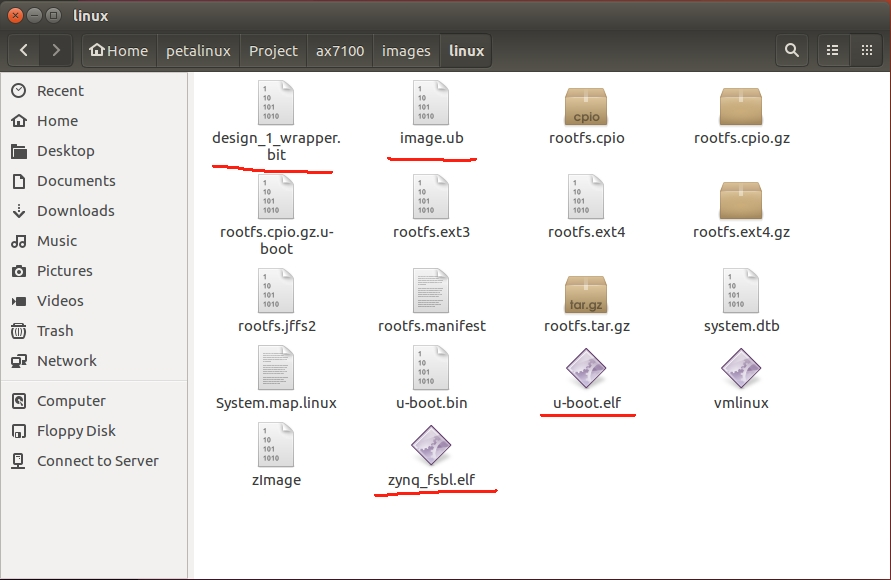

# Petalinux定制linux系统

使用Petalinux定制linux系统主要是为后续[SDSoc软件搭建平台](/SDSocIDE平台搭建/README.md)提供启动引导文件(u-boot)以及linux内核文件(image.ub)。

软件平台：Petalinux 2017.4

参考文件：赛灵思官方文档ug1146。

硬件平台来源：[Vivado硬件平台创建](/Vivado硬件平台创建/README.md)

## Petalinux定制软件平台主要步骤

### 1.创建Petalinux工程文件

添加环境变量：

    source /opt/pkg/petalinux/settings.sh

其中/opt/pkg/petalinux/为petalinux的安装路径，根据自己的安装路径进行修改。创建zynq7000系列工程文件，文件名为ax7100。

    petalinux-create --type project --template zynq --name ax7100

### 2.导入硬件平台并配置petalinux 启动项、内核、根文件系统、设备树
#### 2.1 导入硬件平台

    petalinux-config --get-hw-description ../hardware

其中../hardware为储存hdf文件的文件夹。

Kernel Bootargs→generate boot args automatically (OFF)

for Zynq-7000: Kernel Bootargs→ user set kernel bootargs (console=ttyPS0,115200 earlyprintk quiet)
#### 2.2 配置petalinux内核
执行命令：

    petalinx-config –c kernel

for Zynq-7000: Device Drivers→ Generic Driver Options → Size in Mega Bytes(256)

Device Drivers → Staging drivers (ON)

Device Drivers → Staging drivers → Xilinx APF Accelerator driver (ON)

Device Drivers → Staging drivers → Xilinx APF Accelerator driver → Xilinx APF DMA engines support (ON)

#### 2.3 配置petalinux跟文件系统
执行命令：

    petalinx-config –c rootfs

Filesystem Packages → misc → gcc-runtime → libstdc++ (ON)
#### 2.4 配置petalinux设备树

执行 

    gedit project-spec/meta-user/recipes-bsp/device-tree/files/system-user.dtsi
添加以下内容到system-user.dtsi文件中。

    /{
    xlnk {
    compatible = "xlnx,xlnk-1.0";
    };
    };
（由于硬件平台中配置了can接口，因此设备树文件中需要添加can接口配置。）

    &can0 {
        status = "okay";
    };

### 3.编译petalinux系统

执行命令

    petalinux-build

编译生成的文件保存在./images/linux文件夹中

