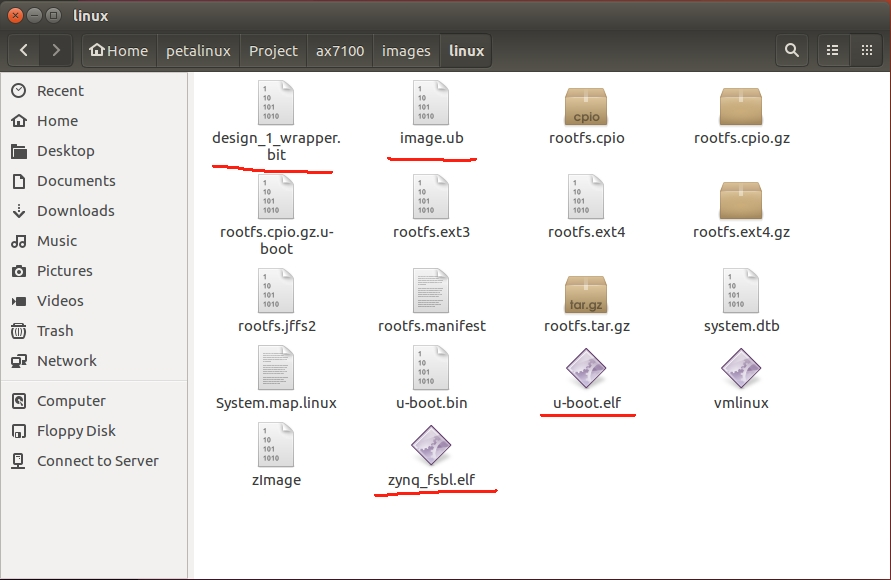
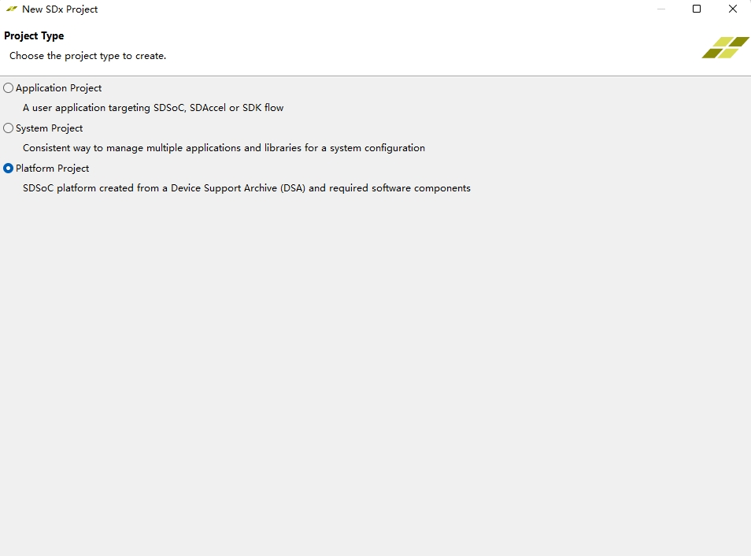
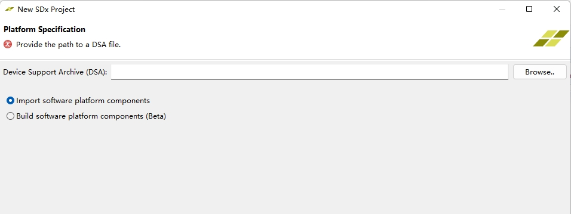
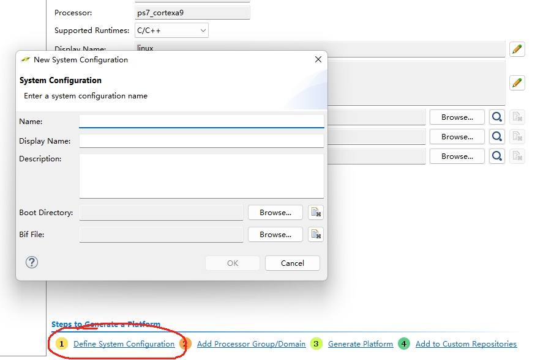
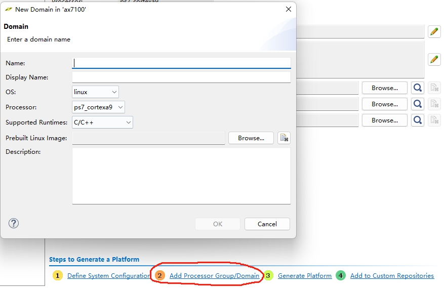
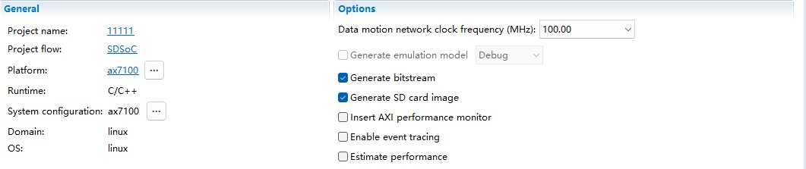

# SDSoc 平台创建

软件平台：SDSoc 2017.4

参考文件：赛灵思官方文档ug1146。

硬件平台来源：[Vivado硬件平台创建](/Vivado硬件平台创建/README.md)

软件平台来源：[Petalinux定制linux系统](/Petalinux软件平台搭建/README.md)

## 1.准备工作

首先创建两个文件夹，boot文件夹和image文件夹。将[petalinux生成的文件](/Petalinux软件平台搭建/README.md)放入这两个文件夹中，需要用到的文件：

u-boot.elf:linux内核引导文件。（放入boot文件夹中）

design_1_wrapper.bit:包含FPGA的硬件信息。（放入boot文件夹中）

image.ub:linux内核文件。（放入image文件夹中）

zynq_fsbl.elf:引导u-boot文件，重命名为fsbl.elf。（放入boot文件夹中）

linux.bif:打包zynq_fsbl.elf、design_1_wrapper.bit、u-boot.elf为BOOT.BIN文件，linux启动识别bin文件。（放入boot文件夹中）

其中linux.bif文件需要自己新建，并加入以下内容：

    /* linux */
    the_ROM_image:
    {
    [bootloader]<fsbl.elf>
    <design_1_wrapper.bit>
    <u-boot.elf>
    }
<>内最好填对应文件的绝对路径，不包含<>符号。

## 2.建立SDSoc平台项目
新建SDSoc项目，选择平台项目，如下：

导入[Vivado硬件平台创建](/Vivado硬件平台创建/README.md)的dsa文件

## 3.配置SDSoc平台

### 3.1 SDSoc平台启动文件配置
点击红圈圈中的部分，会弹出system configuration的配置框，配置如下：

Name：ax7100；（随便填写）

Boot Directory：准备工作中的boot文件夹；

Bif File：boot文件夹中的linux.bif文件。

### 3.2 SDSoc平台内核文件配置

点击红圈圈中的部分，会弹出Domain的配置框，配置如下：

Name：linux

Prebuilt Linux Image：准备工作中的image文件夹。

其他配置不变。

### 3.3 配置SDSoc平台

依次点击Generate Platform和Add to Custom Repositories选项，完成后建立的平台文件就集成在SDSoc系统中。

## 4.使用搭建的SDSoc平台创建应用项目

新建应用工程选择新建立的平台文件，并编写对应的应用程序。

生成SD文件时需要勾选Generate bitstream选项和Generate SD card image选项

（Note：不选中Generate bitstream选项不会生成对应的SD卡文件）

