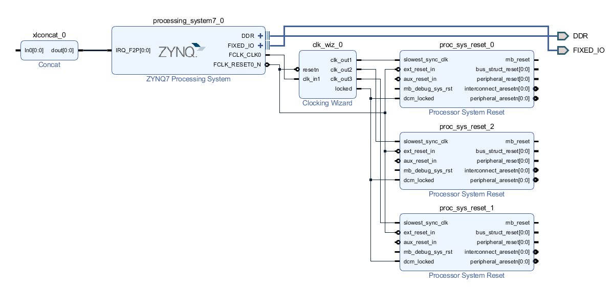
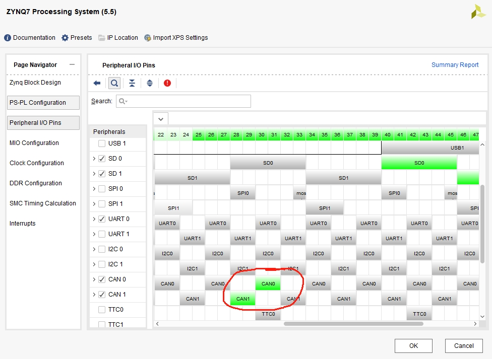
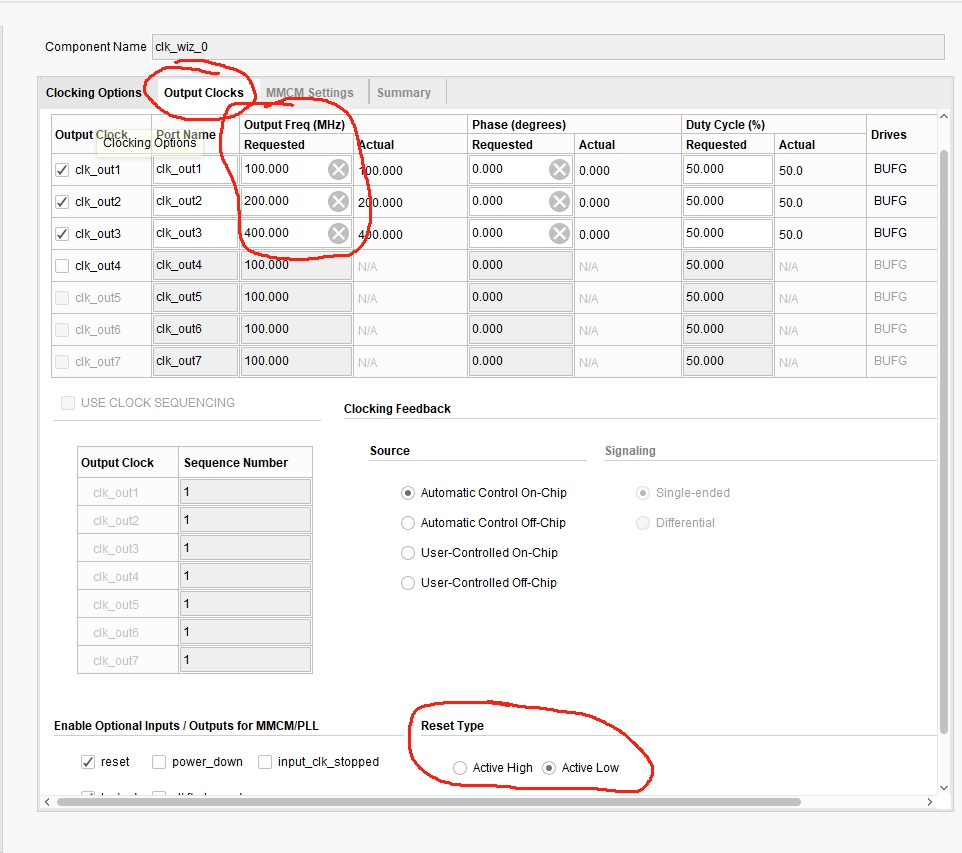
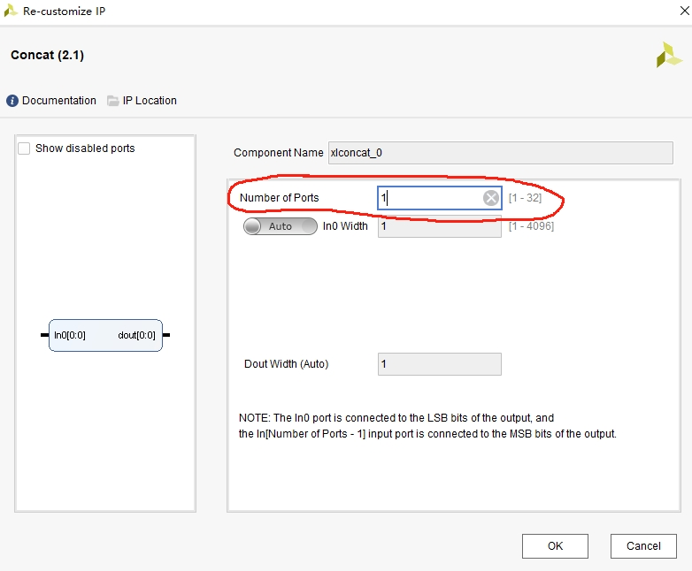
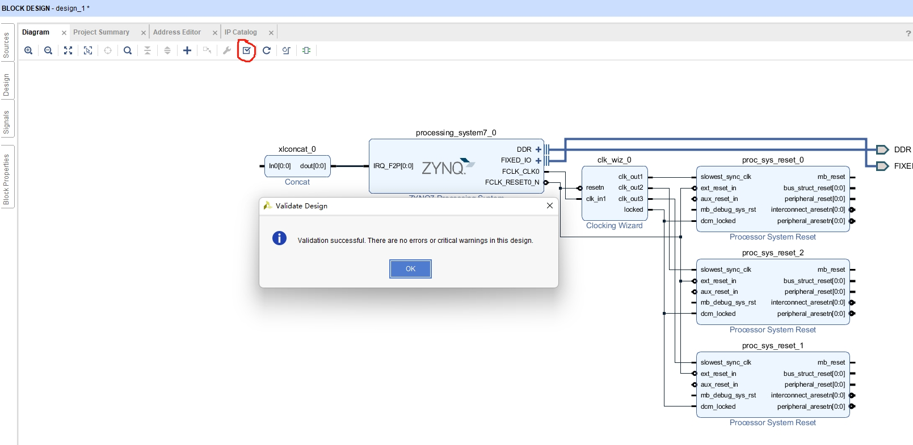
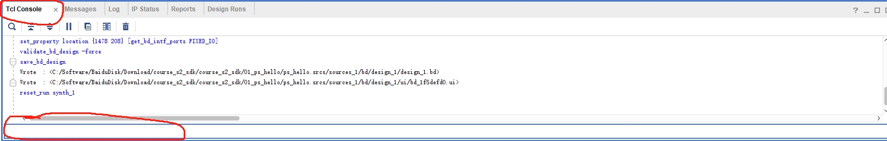
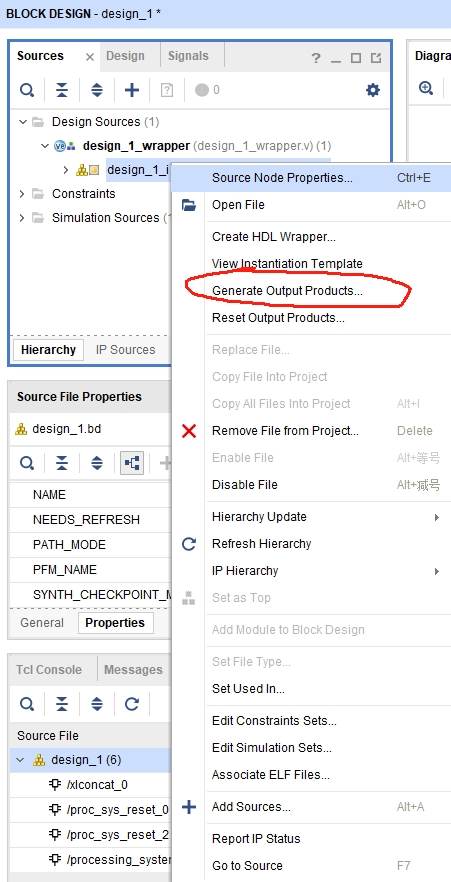
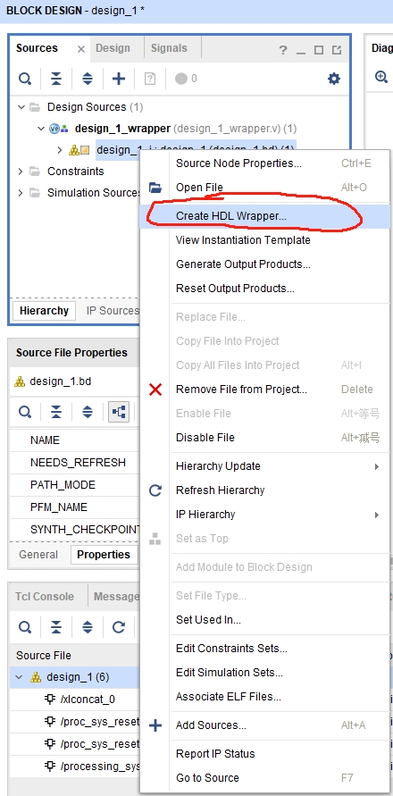
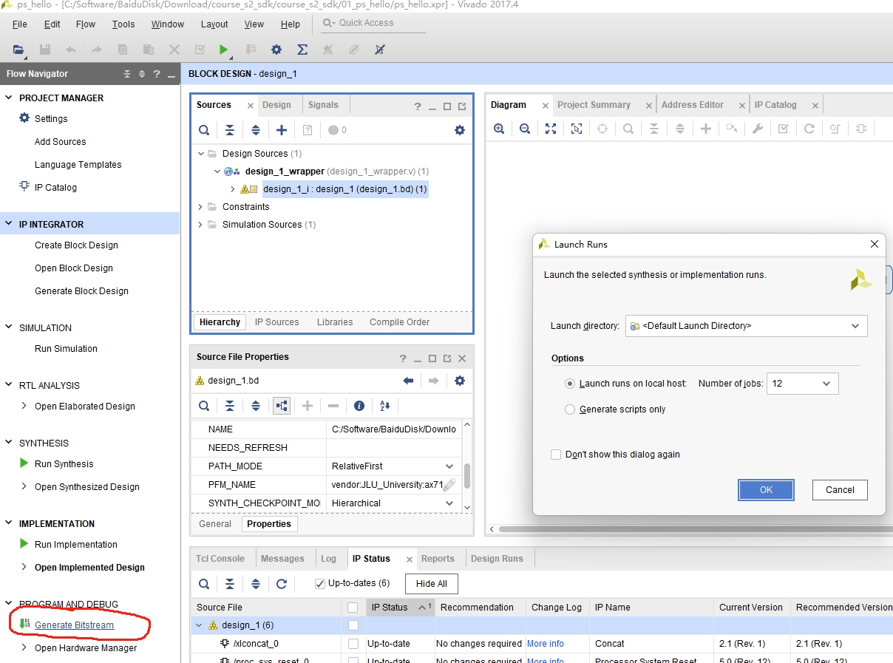
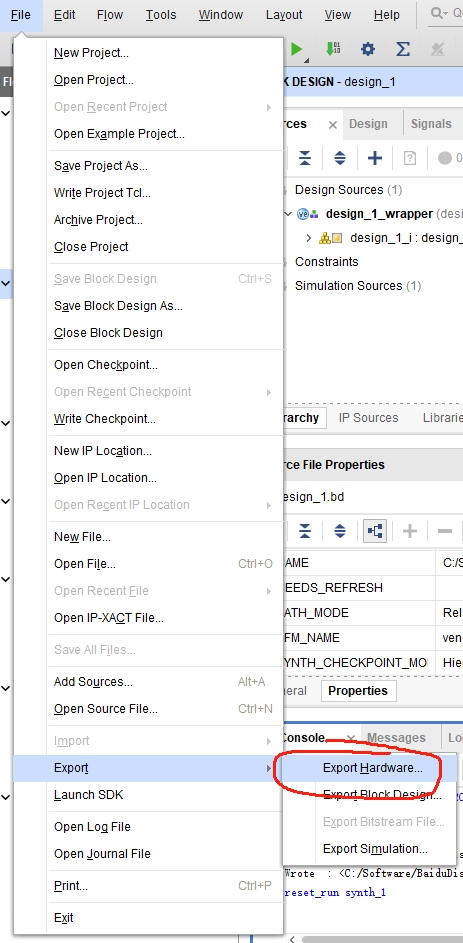

# Vivado硬件平台创建

使用Vivado搭建硬件平台主要是为了给Petalinux软件平台提供硬件基础，具体步骤参考官方文件[UG1146 SDSoc平台创建](/Doc/ug1146.pdf)

硬件平台：Vivado 2017.4

参考文件：

1.赛灵思官方文档ug1146。

2.黑金官方资料course2_sdk工程文件（对应的软件版本为Vivado2017.4）（百度网盘：https://pan.baidu.com/s/1A9kR6tSeThVKQZyBYbQAqA 
提取码：phm6）。

## Vivado硬件平台建立主要步骤

### 1.创建vivado工程以及bd平台

新建vivado工程文件和bd文件。在此由于需要对AX7100开发板的zynq7 IP进行配置，直接打开黑金公司提供的course2_sdk文件夹下的01_ps_hello工程，点击Open Block Design选项打开对应的board文件。

### 2.添加对应的IP及配置
添加完所有IP总体框图如下

框图中包含了一个中断IP，一个时钟IP，一个zynq7000系列IP以及三个复位IP。

（note：时钟IP和复位IP对应，时钟IP设置多少个输出时钟就有多少个复位IP）
####  2.1 添加ZYNQ7系列IP

ZYNQ7000系列IP如果手动添加需要过多配置，建议直接从黑金公司提供的工程进行修改，在此采用的是course2_sdk文件夹下的01_ps_hello工程进行修改。双击ZYNQ7 IP，配置成总体框图对应的接口（后续详细介绍）。

（由于我定制了底板，放弃了USB功能，拓展了两个can接口，因此进行MIO配置，取消选择USB0，选中CAN0,CAN1两个接口

）

####  2.2 添加时钟IP
点击Add IP，搜索clocking wizard，添加clocking wizard模块，双击模块，进行如下配置，添加时钟模块输出时钟频率，分别为100HZ,200HZ,400HZ。Reset Type选择Active Low。

####  2.3 添加复位IP

点击Add IP，搜索Processor system reset，添加Processor system reset模块。此模块不用进行额外配置。

####  2.4 添加中断IP

number of port设置为1

####  2.5 对应的IP进行连线

具体的连接参考总体框图的连接方法。连接完毕后，点击Validate design选项，提示验证成功即可。

### 3.设置PFM属性
设置PFM属性指令需要和上面加入的IP对应，如添加的IP和上述总体框图一致可以输入以下命令进行配置。设置PFM属性需要在下方的tcl console框中输入对应的指令，位置如图

####  3.1 设置PFM名称

    set_property PFM_NAME ax7100 \
    [get_files ax7100.bd]
ax7100.bd 为创建的bd文件的文件名，ax7100为PFM属性的名称。

（note：PFM名称要和后面SDSoc创建的平台名称保持一致，否则报错

    component type not found in ip repository database sdsoc。

）

####  3.2 设置PFM clock属性
id 0、1、2对应的100MHZ、200MHZ、400MHZ时钟频率，需要哪一个时钟作为默认时钟将false改为true即可，只能有一个默认时钟。clk_out1对应的是2.2步骤中对应的clk_out1。

    set_property PFM.CLOCK { \
    clk_out1 {id "0" is_default "true" proc_sys_reset \
    "proc_sys_reset_0" } \
    clk_out2 {id "1" is_default "false" proc_sys_reset \
    "proc_sys_reset_0" } \
    clk_out3 {id "2" is_default "false" proc_sys_reset \
    "proc_sys_reset_0" } \
    } [get_bd_cells /clk_wiz_0]

####  3.3 设置PFM AXI属性

    set_property PFM.AXI_PORT { \
    M_AXI_GP0 {memport "M_AXI_GP"} \
    M_AXI_GP1 {memport "M_AXI_GP"} \
    S_AXI_ACP {memport "S_AXI_ACP" sptag "ACP" memory \
    "processing_system7_0 ACP_DDR_LOWOCM"} \
    S_AXI_HP0 {memport "S_AXI_HP" sptag "HP0" memory \
    "processing_system7_0 HP0_DDR_LOWOCM"} \
    S_AXI_HP1 {memport "S_AXI_HP" sptag "HP1" memory \
    "processing_system7_0 HP1_DDR_LOWOCM"} \
    S_AXI_HP2 {memport "S_AXI_HP" sptag "HP2" memory \
    "processing_system7_0 HP2_DDR_LOWOCM"} \
    S_AXI_HP3 {memport "S_AXI_HP" sptag "HP3" memory \
    "processing_system7_0 HP3_DDR_LOWOCM"} \
    } [get_bd_cells /processing_system7_0]

####  3.4 设置PFM 中断属性

    set intVar []
    for {set i 0} {$i < 8} {incr i} {
    lappend intVar In$i {}
    }
    set_property PFM.IRQ $intVar [get_bd_cells /xlconcat_0]

### 4.导出硬件平台以及dsa文件
1.生成输出文件

2.生成顶层文件

3.生成bitstream

等待生成bitstream，综合成功后进行导出hdf文件和dsa文件。

4.生成hdf文件

hdf文件为后续[步骤二使用petalinux生成软件平台](../Petalinux软件平台搭建/README.md)需要用到的硬件平台文件。

5.导出dsa文件

dsa文件为后续[步骤三SDSoc生成平台文件](..//SDSocIDE平台搭建/README.md)需要用到的平台文件。导出并验证dsa文件，将下面的命令输入到tcl console命令框

    write_dsa ax7100.dsa -include_bit

    validate_dsa ax7100.dsa -verbose

（note：dsa文件名称要和3.1设置的PFM名称保持一致）

